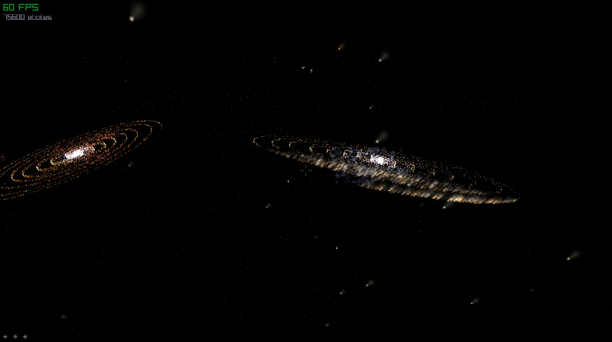

# Stellaris


Simulateur galactique navigable en temps réel, généré procéduralement en Rust/raylib.  
Développé en solo pour une game jam — thème : simulation d'étoiles et de galaxies.



## À propos

Stellaris génère procéduralement trois galaxies spirales navigables en temps réel. Chaque galaxie est construite à partir de bras logarithmiques perturbés par du bruit de Perlin, avec un noyau dense O/B et une distribution spectrale IMF réaliste. L'espace intergalactique est peuplé d'événements dynamiques — supernovae, pulsars, quasars, étoiles filantes — qui s'animent en continu.

Le rendu repose entièrement sur le CPU : aucun GPU dédié requis. Un système de LOD dynamique maintient 60 FPS stables en combinant billboards texturés pour les objets proches et draw_point3D pour les objets lointains. Un bloom software multi-couches est appliqué sur chaque étoile pour simuler la diffusion lumineuse.

## Fonctionnalités

**Génération procédurale**
- 3 galaxies spirales avec bras logarithmiques, bruit de Perlin et inclinaisons distinctes
- 75 600 étoiles avec types spectraux O/B/A/F/G/K/M et distribution IMF approximée
- Couleur dominante par galaxie : bleutée (jeune, O/B), orangée (vieille, G/K), rougeâtre (irrégulière, K/M)
- Noyau dense surreprésenté en O/B, généré indépendamment des bras

**Rendu**
- LOD dynamique : billboards texturés < 200u, draw_point3D au-delà
- Bloom software : 3 billboards concentriques par étoile (facteurs 1×, 2.5×, 5×)
- Nébuleuses intégrées aux bras galactiques, 60 billboards par nébuleuse avec variation de teinte
- Trous noirs avec disque d'accrétion (blanc chaud / orange-rouge) et lensing gravitationnel sur les étoiles proches
- Poussière cosmique : 55 000 points en sphère 360° + disque local aplati
- Rendu CPU uniquement — aucune dépendance GPU

**Événements temps réel**
- Supernovae pulsantes, pulsars clignotants, quasars à triple halo
- Amas globulaires (40–80 étoiles), étoiles binaires
- Étoiles filantes avec traînée (pool de 8, spawn aléatoire)

**Navigation**
- 6DOF libre dans l'espace 3D
- 3 paliers de vitesse (exploration / traversée / saut)
- 60 FPS stable sur i5/Ryzen 5, 8 Go RAM, sans GPU dédié

## Contrôles

| Touche | Action |
|--------|--------|
| Z / S | Avancer / Reculer |
| Q / D | Strafe gauche / droite |
| Espace | Monter |
| C | Descendre |
| Souris | Orienter la vue |
| Molette | Changer de vitesse (3 paliers) |
| Échap | Quitter |

## Compilation

**Prérequis :** Rust stable (`rustup`), `cmake` (requis par raylib-sys)

```bash
# Linux
cargo build --release
./target/release/stellaris

# Windows (natif ou cross-compile depuis Linux avec cargo-xwin)
cargo build --release
target\release\stellaris.exe
```

Les textures (`assets/star_halo.png`, `assets/nebula_cloud.png`) sont générées automatiquement au premier lancement. Aucune dépendance externe à installer manuellement.

## Stack technique

| Crate | Rôle |
|-------|------|
| `raylib-rs 5.5` | Rendu, fenêtre, inputs |
| `noise` | Bruit de Perlin pour les bras spiraux |
| `rand` | Distributions aléatoires reproductibles |
| `image` | Génération des textures PNG au démarrage |

## Intelligence artificielle

Ce projet a été développé avec l'assistance de Claude (Anthropic).  
Claude a contribué à la documentation, à certaines idées de fonctionnalités (bloom software, système d'événements, pipeline de rendu), et au débogage visuel.  
Tout le code a été écrit par le développeur.  
Conformément aux règles de la game jam, ce projet porte le tag **IA**.

## Licence

[GPLv3](LICENSE)
